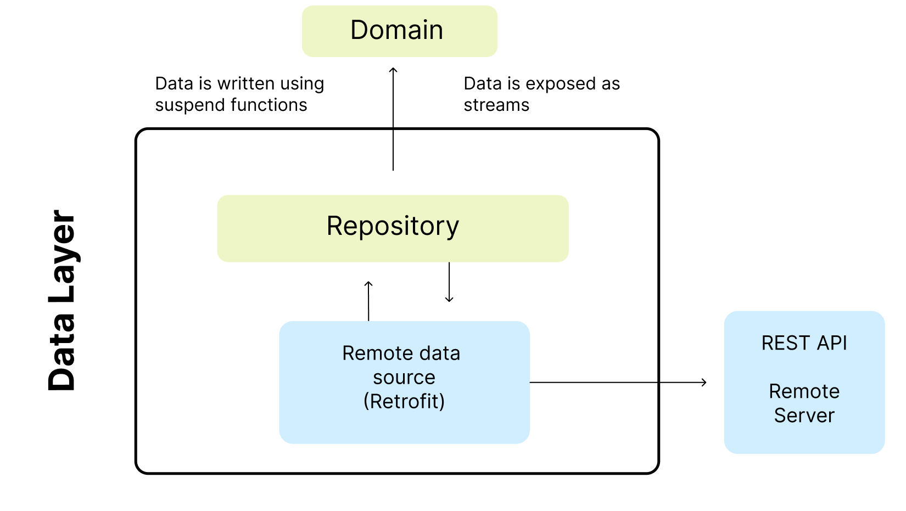

Games App
==================

**Games App** is a fully functional Android app built entirely with Kotlin and Jetpack Compose. This
Follows Android design and development best practices.

## Tech stack & Open-source libraries

- Minimum SDK level 24
- Kotlin based, Coroutines flow + StateFlow for asynchronous.

- **Jetpack**
    - Compose: A modern toolkit for creating a native android UI
    - Lifecycle: Observe Android lifecycles and handle UI states upon the lifecycle changes.
    - ViewModel: Manages UI-related data holder and lifecycle aware. Allows data to survive configuration changes such as screen rotations.
    - Hilt: for dependency injection.

- **Architecture**
    - MVI Architecture (Model - View - Intent)
    - Module Pattern
    - Repository Pattern
  
- **Retrofit2 & OkHttp3:** Construct the REST APIs and paging network data.
- **Gson:** A modern JSON library for Kotlin and Java.

## Architecture

The **Games App** app follows the
[official architecture guidance](https://developer.android.com/topic/architecture)
and is described in detail in the.

## Architecture overview

The app architecture has two layers: a [data layer](https://developer.android.com/jetpack/guide/data-layer) and [UI layer](https://developer.android.com/jetpack/guide/ui-layer)

The architecture follows a reactive programming model with [unidirectional data flow](https://developer.android.com/jetpack/guide/ui-layer#udf). With the data layer at the bottom, the key concepts are:

*   Higher layers react to changes in lower layers.
*   Events flow down.
*   Data flows up.

The data flow is achieved using streams, implemented using [Kotlin Flows](https://developer.android.com/kotlin/flow).

## Data layer

The data layer is implemented to connect to our web service, in this case it is the source for the application's data.

The repository has its own model. For example, the `Game Repository` has a `Game Response` model.

Repositories are the public API for other layers, they provide the _only_ way to access the app data. The repositories typically offer one or more methods for reading and writing data.
